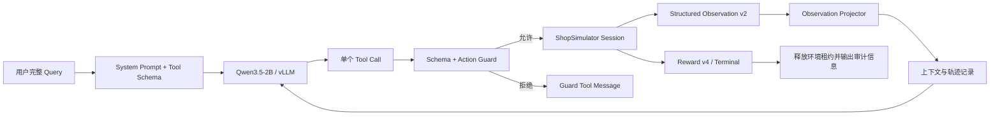

# Harness 设计说明

## 0. 先建立正确心智模型

Harness 不是 ShopSimulator 的替代品，也不是替模型选商品的规则引擎。它是夹在模型和有状态环境
之间的执行控制层，核心工作可概括为四件事：

1. 协议控制：模型每回合只能产生符合 Tool Schema v2 的单个动作；
2. 状态控制：只依据最新可见页面校验动作，避免使用过期 ASIN、按钮或规格；
3. 预算控制：Observation 和完整上下文必须在 token 合同内，同时保留动作目标；
4. 生命周期控制：创建与释放 Session，区分模型失败、正常终局和基础设施无效。

项目有两个 Harness 入口：

| 入口 | 主要用途 | 模型调用 | 生命周期实现 |
|---|---|---|---|
| `evaluation/rollout.py` | Baseline/SFT/GRPO 的独立评测与轨迹采集 | OpenAI-compatible client | 显式 while-loop + `try/finally` |
| `training/grpo/adapter/` | veRL 异步 GRPO rollout | veRL `ToolAgentLoop` + vLLM | 覆写生成、工具、终局三个边界 |

两者共享工具定义、动作映射、Action Guard、Observation renderer/projector 和上下文算法，但并不是
同一个循环实现。优化时必须同时检查两条路径，不能用“一边测试通过”推断另一边行为相同。

## 1. 总体架构



评测入口和 GRPO AgentLoop 共享 Environment、Tool Schema、Observation Projector、Action Guard
和上下文压缩算法，但在模型调用和轨迹封装层分别适配普通 OpenAI-compatible Client 与 veRL。

## 2. Session 与环境租约

每条 trajectory 创建独立 `ShopSimulatorSession`：

1. 在线程中执行同步 `reset(task_id)`，避免阻塞异步事件循环；
2. 校验环境版本必须为 `shopsimulator-environment-v2.4`；
3. 使用 `ContextVar` 绑定当前环境和运行状态，防止并发轨迹串状态；
4. 所有退出路径通过 `finally` 释放租约；
5. reset 或 release 异常单独记录为基础设施事件，不伪装成模型失败。

### 2.1 三类状态的所有权

| 状态 | 权威持有者 | Harness 中的副本 | 用途 |
|---|---|---|---|
| 页面、搜索结果、已选规格、终局 | ShopSimulator Session | 无权威副本 | 环境执行与 Reward |
| 模型最近可见页面 | Harness runtime | `latest_observation` | Prompt 与 Action Guard |
| 已查看候选工作记忆 | Harness runtime | trajectory-local `candidate_memory` | Final-240 稳定保存 C1-C4 的公开候选及重新定位线索 |
| 轨迹诊断 | Harness runtime/trajectory | steps、投影、压缩、拒绝、终局字段 | 训练过滤、评测和排障 |
| 隐藏目标与 TaskFacts | Environment/受控评测逻辑 | 不得进入模型消息 | Reward 与离线分析 |

`latest_observation` 只是最近一次模型可见快照，不是环境真实状态本身。真正的页面状态仍在环境
Session 中；Harness 不能通过修改该字符串来改变页面。

### 2.2 一条 Episode 的逐步调用链

```text
1. reset(task_id)
2. 校验 Environment v2.4，构造 runtime state
3. System + Query + Tools 进入模型
4. 模型生成一个 tool call
5. Schema 校验 → Action Guard
6. tool_call_to_action() 转为 search[] / click[] / finish[]
7. Environment step(action)
8. 用公开搜索结果或详情页更新 trajectory-local 候选记忆
9. render_structured_observation() 过滤隐藏字段、插入候选摘要并统一格式
10. 候选达到 3 个后，在下一轮 Evaluation System Prompt 最前面动态加入收敛提醒
11. project_observation() 用页面预算加独立记忆预算，并验证动作目标不变量
12. tool observation 写回上下文，进入下一轮
13. 环境终局、模型错误或基础设施事件结束 trajectory
14. 结算 Reward/诊断并在 finally 中 release
```

注意“动作尝试”和“环境执行步骤”不是同一概念。Guard 拒绝会增加拒绝与尝试计数，但不会调用
`env.step()`；通过 Guard 的 `think` 会消耗 Harness 步数，却不改变环境状态。

## 3. Tool Call 转换与单动作合同

Tool Schema v2 的所有对象都使用 `additionalProperties=false`。Harness 在执行前检查：

- 工具是否存在；
- 参数必须是对象；
- 是否缺少必填参数或包含额外参数；
- 字符串类型和必填空字符串；
- 每个 assistant 回合最多一个 Tool Call；
- 无参数工具必须传严格 `{}`。

通过后再将 `search_products/open_product/select_option/...` 转换成环境 Action。训练和评测入口检测到
多个 Tool Call 时都只保留第一个，并记录其余调用；两者都不会在同一份旧 Observation 上并行执行
多个环境动作。仍需通过双入口测试保证记录字段、父类 turn 计数和终止封装一致。

## 4. Observation v2 与投影合同

环境先返回结构化公共状态，renderer 拒绝 `goal`、`reward`、`target_asin`、`answer` 等隐藏字段，
再统一渲染正文和 footer。当前预算：

| 页面 | Token budget | 必须保留 |
|---|---:|---|
| 搜索结果 | 2,560 | 当前页全部商品边界、20 个 ASIN、价格和完整 footer |
| 商品详情 | 3,072 | 当前价格、关键属性、已选规格、可选规格和按钮 |
| 普通/信息子页 | 512 | 页面内容、搜索状态和全部可执行按钮 |
| 候选记忆（附加） | 1024 | Final-240 的 C1-C4 候选摘要，不挤占上述页面预算 |

投影后会再次计算 Token，并验证：

模型可见顺序固定为：Observation 版本与页面类型 → 可选的步数/循环提醒 → 当前页面正文 → 可选的候选记忆 → 动作 footer。

- 搜索页原始 ASIN 集合与模型可见 ASIN 集合完全一致；
- 模型可见 ASIN 集合与 Action Guard 允许集合完全一致；
- 非搜索页按钮集合不能发生变化；
- 搜索状态、导航按钮和 footer 必须完整保留；
- 整页无法安全放入预算时抛出 `ObservationProjectionError`，轨迹标为基础设施无效。

因此压缩只能缩短长字段或正文，不能静默删除商品、按钮、价格轴或规格动作目标。

### 4.1 候选记忆

Final-240 Evaluation Harness 为每条 trajectory 稳定保存最先核验的 4 个商品，记录 ASIN、价格、品牌、
品类、已选规格、标题、公开属性证据，以及打开商品时的搜索词、页码和 rank。模型看到的是 C1-C4；
编号在当前轨迹内保持稳定，不表示优劣、满足情况或推荐。达到 4 个后，后续商品仍能正常搜索和核验，
但不会写入或替换已有记忆。

同一 ASIN 重访会更新原记录而不会复制。记忆只用于比较和重新定位：历史 ASIN 不会仅因进入记忆就
变成可点击目标，也不存在候选直达工具；模型必须重新搜索，待 ASIN 再次出现在最新搜索结果页后才能
调用 `open_product`。

当候选数达到 3 时，候选记忆块会显示确定性收敛提醒；Evaluation 下一轮请求还会把同一语义的提醒
动态放到 System Prompt 最前面。提醒要求优先比较并购买已满足全部要求的候选，但不收缩工具集合、
不替 Harness 判断候选是否合格，也不改变 6 步无进展的环境终止阈值。
记忆不读取 Gold、Reward、隐藏目标、匹配分或约束满足判断，因此不是推荐器，也不构成答案泄漏。

## 5. Action Guard 边界

Guard 硬拦截会污染环境的动作：

- 当前页不可搜索时调用搜索；
- 打开当前 Observation 不存在的 ASIN；
- 选择当前页面不存在的规格；
- 把导航按钮作为规格；
- 在信息子页直接切换信息面、选择规格或购买；
- 非法 `finish_without_purchase` reason；
- Schema 之外参数和未知工具。

拒绝时动作不会进入环境。评测入口会把当前可打开 ASIN、按钮和恢复方式详细反馈给模型；GRPO
Tool Adapter 当前返回较简短的拒绝原因。两条路径都会累计连续拒绝，达到 3 次后终止轨迹。

Guard 不判断品类语义、品牌是否合适、功能证据是否充分、候选是否最优或是否应该买。这些仍
属于模型策略、Reward 和离线 Judge，避免 Harness 替 Agent 做任务决策。

## 6. 上下文工程

正式 GRPO 配置 `configs/agent_loop.yaml` 使用：

- 30,000 context window；
- 单回合最多 768 generation tokens；
- 512 tokens 安全余量；
- 输入预算 28,720 tokens；
- 最大 45 个工具步；
- Actor 单卡 Token budget 30,000；Actor/Reference log-prob budget 36,000；
- 单次工具返回最大 16,384 tokens，中间裁剪由 veRL fallback 负责。

当前 `configs/agent_loop.yaml` 启用确定性上下文压缩。它不是让小模型生成摘要，而是：

1. 固定保留初始 System Prompt、完整用户 Query 和工具定义；
2. 将历史识别为完整 assistant tool-call + tool observation 组；
3. 仅从最旧的完整组开始删除；
4. 至少保护最近一个完整交互组；
5. 同步裁剪 prompt ids、response mask 和 response log-prob，保持训练数组对齐；
6. 固定 Prompt 加最新 Observation 仍超预算时终止为基础设施异常，不截断 Query。

压缩事件记录原始 Token、最终 Token、删除 Token 和删除组数，便于区分模型错误与上下文工程
影响。

候选记忆补偿了完整旧交互组被删除后可能丢失的早期商品事实；Final-240 入口使用 4 条稳定上限和
字段长度上限，避免工作记忆无限增长。GRPO Adapter 当前默认值应以 `runtime.py` 为准并单独审计。

评测入口的上下文窗口和是否压缩由评测启动参数决定，不应直接套用 GRPO 的 30K 配置。分析结果
时要同时记录模型上下文上限、生成预留、安全余量和实际输入峰值。

## 7. 循环与步数提示

评测 Rollout 会读取环境的 `progress.no_progress_steps`：

- 连续 3 步没有新增候选、商品证据或规格证据时，Observation 增加确定性循环提醒；
- 已执行步数达到 35 时增加“目前 x/45 步”的预算提醒；
- 提示插入 footer 之前，投影器会继续保留它们。

候选达到 3 个时还会增加收敛提醒：Evaluation 把它动态前置到 System Prompt，renderer 同时写入候选
记忆块。它只给出“停止过度搜索、比较现有候选、满足全部要求就购买”的方向，不指定哪个候选合格。
循环提醒和候选提醒都不会修改工具白名单或 Environment 的终止计数。
当前 veRL GRPO Adapter 读取环境公开的 `progress.no_progress_steps` 与
`candidate_recovery_required`，应用同样的 3 步提醒、35 步预算提醒和 6 步候选强制收敛。
veRL 初始 prompt 保持稳定的 8 工具定义，后续每轮由 Action Guard 按页面与候选阶段动态执行
同一白名单；这是为了避免在不中断 token 轨迹的情况下重建完整 prompt。

## 8. 终局与基础设施事件

Harness 区分三类结束：

- 环境正常终局：购买或合法结束，读取 Reward v4；
- 模型终局错误：例如直接输出 assistant final，作为有效负样本参与学习；
- 基础设施无效：环境版本、投影、上下文、生成中断、Reward 结构或服务异常，不作为零分模型样本。

轨迹记录至少包含工具步骤、动作尝试、重复动作、Guard 拒绝、Observation 投影、上下文压缩、
Reward 类型、终局原因和环境释放状态。

### 8.1 终局判定速查

| 情况 | 是否模型样本 | 奖励处理 |
|---|---|---|
| `gold_purchase` 且 `reward_valid=true` | 有效成功样本 | 使用 Reward v4 terminal utility |
| 其他可验证购买/合法结束 | 有效非严格成功样本 | 使用环境终局 Reward |
| assistant 未调用终止工具而直接输出 final | 有效负样本 | `assistant_final=-0.8`，再叠加累计步数惩罚 |
| Guard 连续拒绝、最大步数 | 模型行为失败 | 保留原因，不能伪装成成功 |
| 单回合多个 Tool Call | 只执行第一个 | 记录被丢弃调用，不并行写环境 |
| 环境版本错误、投影失败、上下文无法安全容纳、服务异常 | 基础设施无效 | 不作为普通零分模型样本 |
| `reward_unverifiable` 或 Reward 结构不可信 | 采样无效 | 不得算严格成功 |

严格成功只有一个口径：完整 `gold_purchase` 终局且 `reward_valid=true`。

## 9. veRL 异步 AgentLoop 接入

`ShoppingToolAgentLoop` 复用 veRL 0.8 的生成状态机，只在关键边界插入项目合同：

- 生成前检查/压缩上下文并限制单回合 Token；
- 工具执行后投影 Observation；
- 处理 Tool Calls 时禁止并行动作；
- 轨迹结束时统一结算 Reward；
- `finally` 释放 ShopSimulator 租约；
- 将 `shopping_info` 写回 veRL 输出，供动态采样和训练日志统计。

这样 Harness 保持轻量：不重新实现 vLLM 生成、PPO/GRPO 更新或 ShopSimulator Reward，只负责
把这些组件用一致、可恢复、可审计的合同连接起来。

## 10. 设计评审时必须追问的六个问题

1. 这个改动是否改变了模型能看到的信息，是否可能泄漏隐藏目标？
2. 模型可见目标、Guard 允许目标和环境可执行目标是否仍然一致？
3. 评测入口与 GRPO 入口是否都应用了同一个合同？
4. 失败属于模型行为还是基础设施，轨迹里能否无歧义地区分？
5. token、步数、并发和 Session 释放是否存在另一层更早的限制？
6. 是否有测试覆盖正常路径、拒绝恢复、预算边界、终局和异常释放？
